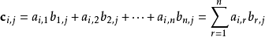
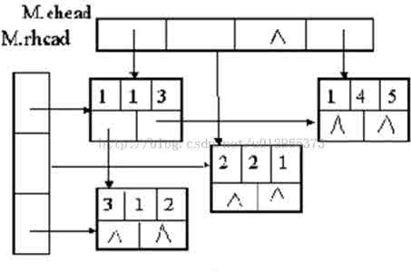

本文是在参考了清华大学严蔚敏教授的《数据结构》中关于“矩阵的压缩存储”一文之后，对文中内容的一些思路分析，详细注解和代码的具体实现。

## 数学基础

以下内容摘自百度百科：
>在数学中，矩阵（Matrix）是一个按照长方阵列排列的复数或实数集合，最早来自于方程组的系数及常数所构成的方阵。这一概念由19世纪英国数学家凯利首先提出。<br/>矩阵是高等代数学中的常见工具，也常见于统计分析等应用数学学科中。计算机科学中，三维动画制作也需要用到矩阵。 矩阵的运算是数值分析领域的重要问题。将矩阵分解为简单矩阵的组合可以在理论和实际应用上简化矩阵的运算。对一些应用广泛而形式特殊的矩阵，例如稀疏矩阵和准对角矩阵，有特定的快速运算算法。

我们这里主要谈稀疏矩阵。关于稀疏矩阵，并没有具体的定义。通常认为：在m * n矩阵中有t个非零元素，当t/(m * n) <= 0.05 时该矩阵为稀疏矩阵。

矩阵的加法和乘法：两个同型矩阵之间可以做加法，对应数相加即可。而乘法须是m * n矩阵和n * p矩阵相乘，他们乘积矩阵C是一个m * p矩阵，它的每一个元素为：



矩阵的转置：把矩阵A的行和列互相交换所产生的矩阵称为A的转置矩阵，这一过程称为矩阵的转置。


## 压缩存储

矩阵存储最一般的方式，是用一个二维数组来存储。

```c
#define SIZE1 100

#define SIZE2 100

typedef struct {
    int mu, nu;
    double datap[SIZE1][SIZE2]
}
```

但是，在非零的元素比较少的情况下，我们之间使用二维数组会浪费很大的空间，所以此时我们只存储非零的部分即可。可以用 (i，j，a)来代表矩阵第i行第j列的数a。

于是，我们很快可以写出如下的定义：

```c
#define SIZE 100

typedef struct {
    int i, j;//该元素的下标
    double a;//该元素
} triple;

typedef struct {
    Triple data[SIZE+1];//这里不使用第零个，是为了之后方便计数，元素按照行主序排列
    int mu, nu, tu;//矩阵的行数，列数，非零元个数
} TSMatrix;
```
***元素按照行主序排列会在很多运算的算法编写上方便很多，至于为什么，等会在具体的地方说明***

## 相关操作算法

### 矩阵转置

***接下来我们的例子使用矩阵 (1,2,12),(1,3,9),(3,1,-3),(3,6,14),(4,3,24),(5,2,18),(6,1,15),(6,4,-7)***

根据定义，转置是很容易做到的，我们只需要交换每个元素的i，j的值即可。但是要注意，交换之后我们必须重排三元组，使得转置后的矩阵仍然是以行为主序排列的。那么与其转置之后排序，不如在转置的时候以列为主序进行转置，这样得到的转置矩阵自然是以行为主序的了。

我们可以用一个双循环搜索第col列进行转置，代码如下：

```c
void TransposeSMatrix(TSMatrix M, TSMatrix T) {
    T.mu = M.nu, T.nu = M.mu, T.tu = M.tu;
    if (T.tu) {
        int col, p, q = 1;
        /* col代表列，p代表M中元素的顺序，q代表n中元素的顺序 */
        for (col = 1; col <= M.nu; col++)
            for (p = 1; p <= M; p++)
                if (M.data[p].j == col) {
                    /* 在M中逐个搜索第col列的数 */
                    T.data[q].i = M.data[p].j;
                    T.data[q].j = M.data[p].i;
                    T.data[q].a = M.data[p].a;
                    q++;//赋值，并使得计数器q增加1
                }
    }
}
```

以上的算法显然是比较不好的，由于使用了双重循环，其时间复杂度为O(nu * tu)，和一般二维数组存储的矩阵直接行列双重循环转置相比（时间复杂度O(mu * nu)），当tu较大时，该算法的劣势就很明显了，因此其仅适用于非常稀疏的矩阵。

我们再来看看刚才的算法，分析发现，在程序运行的过程中，大部分的时间被浪费在了从头开始搜索第col行的元素上面。因此，如果我们能直接确定，a.data中的某个元素在b.data中的哪个位置，就能很容易的进行转置了，为此，我们需要构造两个数组，num[col]代表矩阵M中第col列非零元的个数，cpot[col]代表矩阵M中第col列的第一个非零元在b.data中的位置。

接下来考虑求这两个数组，利用数列递推的方法，我们有：

* cpot[1] = 1
* cpot[col] = cpot[col - 1] + num[col - 1]

于是，经过改进的转置算法如下：

```c
void FastTransposeSMatrix(TSMatrix M, TSMatrix T) {
    T.mu = M.nu, T.nu = m.mu, T.tu = M.tu;
    if (T.tu) {
        int t, p, q, num[M.nu + 1], cpot[M.nu + 1];
        cpot[1] = 1;
        for (col = 1; col <= M.mu; col++)//按行处理初始化
            num[col] = 0;
        for (t = 1; t <= M.tu; t++)//遍历矩阵，并统计每行的非零元个数
            ++num[M.data[t].j];
        for (col = 2; col <= M.nu; col++)
            cpot[col] = cpot[col - 1] + num[col - 1];
        /* 以上为构造两个数组 */
        for (p = 1; p <= M.tu; p++) {
            col = M.data[p].j;//取出行
            q = cpot[col];
            T.data[q].j = M.data[p].i;
            T.data[q].i = M.data[p].j; 
            T.data[q].a = M.data[p].a;
            cpot[col]++;//此时cpot[col]变成第col列的下一个非零元所应该在的位置
        }
    }
}
```

这个算法和上面的相比，复杂度为O(nu + tu)，即使是tu很大时，它的复杂度也为O(mu * nu)，因此这个算法的优势是明显的。

### 矩阵乘积

矩阵相乘，在上面已经介绍过，乘积矩阵的 (i,j) 元的算法公式如下：


对于二维数组存储的矩阵，其乘积算法是十分明确的，直接根据公式，有

```c
void MultMatrix(Matrix A, Matrix B, Matrix C) {
    int i, j, k;
    for (i = 1; i <= A.mu; i++)
        for (j = 1; j <= B.nu; j++) {
            C.data[i][j] = 0;//初始化为0
            for (k = 1; k <= B.mu; k++)
                C.data[i][j] += A.data[i][k] * B.data[k][j];//直接套公式
        }
}
```

当我们使用三元组来压缩存储时，我们就不能使用以上的算法。并且这个时候，我们想取出矩阵A和B中对应序号的元素进行乘法运算也是困难的，必须从头开始搜索矩阵。

为了避免这个问题，我们调整下矩阵的定义，类似于刚刚的cpot[col]数组，我们构造表示各行第一个非零元的位置的rops[row]数组，这样就能方便地实现直接存取矩阵的任意元素。代码如下：

```c
typedef struct {
    Triple data[SIZE + 1];
    int rops[MAXRC + 1];//各行第一个非零元的位置表
    int mu, nu, tu;
} RLSMatrix;
```

接下来我们一步步来讨论压缩存储时矩阵乘法的算法。

首先，由于乘积的两个数中有一个是零，积就是零，所以我们大可不必讨论零的情况。直接拿M.data中j值和N.data中i值相同的元素求积即可。

其次，对于行的遍历，我们用相邻的rpot[row]和ropt[row + 1]来控制，注意最后一行的时候要专门讨论，把上界设置成M.tu + 1；

最后，由于求得的乘积中，可能会有零出现，因此对于求得的结果还要再进行一次筛选。

该求积过程的代码如下：

```c
void MultSMatrix(RLSMatrix M, RLSMatrix N, RLSMatrix Q) {
    Q.mu = M.mu, Q.nu = N.nu, Q.tu = 0;
    if (M.tu * N.tu != 0) {
        int arow, brow, ccol, p, tp, q, t;
        int ctemp[M.mu + 1];
        for (arow = 1; arow <= M.mu; arow++) {
            Q.rops[arow] = Q.tu + 1;//求乘积矩阵Q时也把Q的rpos数组求了
            if (arow < M.mu)
                tp = M.rpos[arow + 1];
            else
                tp = M.tu + 1;
            for (p = M.rops[arow]; p < tp; p++)
                ctemp[p] = 0;//当前行的累加器清零
            for (p = M.rops[arow]; p < tp; p++) {//遍历当前行中的非零元
                brow = M.data[p].j;
                if (b.row < M.mu)
                    t = N.rops[brow + 1];
                else
                    t = N.tu + 1;
                for (q = N.rops[brow]; q < t; q++) {//遍历对应N中一行，并求积
                    ccol = N.data[q].j;
                    ctmp[ccol] += M.data[p].a * N.data[q].e
                }
            }
            /* 以上为初步求得结果的过程，接下来进行筛选 */
            for (ccol = 1; ccol <= Q.nu; ccol++) {
                if (ctemp[ccol]) {
                    Q.data[++Q.tu] = {arow, ccol, ctemp[ccol]};
                }
            }
        }
    }
}
```

## 十字链表存储

最后，我们来看另一种矩阵的存储方式。

之前我们讨论了矩阵转置和矩阵乘法，接下来我们来看矩阵加法的问题。在做加法时，非零元的变化会比较大，因此对于这种类型的问题，应该采用矩阵的链式存储结构。

对于矩阵这个二维图形(暂且称作图形吧)，可以用一个十字链表构成网状结构来存储，对于每个元素，设置一个right指针和一个down指针即可。如下图所示。【注意此时十字链表的头指针可不是一个，而是一行和一列】



创建这样十字链表的算法实际上就是多个链表插入和删除的操作集合，代码如下：

```c
typedef struct OLNode {
    int i, j;//该非零元的行和列下标
    double a;
    struct OLNode *right, *down;//右指针和下指针
} OLNode, *OLink;

typedef struct {
    OLink *rhead, *chead;//行和列头指针
    int mu, nu, tu;
} CrossList;

void CreateSMatrix(CrossList *M) {
    int i ,j;
    double a;
    M = (CrossList *)malloc(sizeof(CrossList));
    scanf("%d%d%d", &M->mu, &M->nu, &M->tu);//输入M的行数，列数和非零元个数
    M->rhead = (OLink *)malloc((M->mu + 1) * sizeof(OLink));
    M->chead = (OLink *)malloc((M->nu + 1) * sizeof(OLink));
    /* 初始化头指针 */
    for (i = 1; i <= M->mu; i++)
        M->rhead[i] = NULL;
    for (i = 1; i <= M->nu; i++)
        M->chead[i] = NULL;
    for (scanf("%d%d%lf", &i, &j, &a); i != 0; scanf("%d%d%lf", &i, &j, &a)) {
        OLNode *q, *p = (OLNode *)malloc(sizeof(OLNode));
        p->i = i, p->j = j, p->a = a;
        /* 行插入 */
        if (M->rhead[i] == NULL || M->rhead[i]->j > j) {
            p->right = M->rhead[i];
            M->rhead[i] = p;
        }
        else {
            for (q = M->rhead[i]; (q->right) && (q->right->j < j); q = q->right) {
                p->right = q->right;
                q->right = p;
            }
        }
        /* 列插入 */
        if (M->chead[j] == NULL || M->chead[j]->i > i) {//列插入
            p->down = M->chead[j];
            M->chead[j] = p;
        }
        else {
            for (q = M->chead[j]; (q->down) && (q->down->i < i); q = q->down) {
                p->down = q->down;
                q->down = p;
            }
        }
    }
}
```

接下来，使用十字链表来实现矩阵加法就容易很多了，类似求两个集合的并集的算法，设置两个指针 pa, pb 分别指向矩阵A和B中同一行的元素，分以下四种情况：

* 若 pa == NULL 或 pa->j > pb->j，则将pb所值的元素插入A矩阵中
* 若 pa->j < pb->j，则将pa向右移动一步
* 若 pa->j == pb->j 并且pa->a + pb->a != 0，则将pa->a + pb->a的值赋值给pa->a即可
* 若 pa->j == pb->j 并且pa->a + pb->a == 0，则删除pa所指的结点

当然在插入和删除的时候要注意同时修改前一结点的right和down指针。该过程的算法如下：
```c
void AddSMateix(CrossList *A, CrossList *B) {
    if (A->mu == B->mu && A->nu == B->nu) {
        OLNode *pa, *pb;
        int row;
        /* 按行来加 */
        for (row = 1; row <= A->mu; row++) {
            pa = A->rhead[row], pb = B->rhead[row];
            OLNode *pre = NULL;//辅助指针，用来指示pa的前驱
            OLink *hl = (OLink *)malloc((A->nu + 1) * sizeof(OLink));//每列的列辅助指针
            int i, j;
            for (j = 1; j <= A->nu; j++)
                hl[j] = A->chead[j];
            /* 遍历一行 */
            for ( ; pb != NULL; pb = pb->right) {
                OLNode *p = pb;//辅助指针，用来复制结点
                /* 第一种情况 */
                if (pa == NULL || pa->j > pb->j) {
                    /* 完成行插入 */
                    if (pre == NULL)
                        A->rhead[p->j] = p;
                    else
                        pre->right = p;
                    p->right = pa, pre = p;
                    /* 完成列插入 */
                    if (A->chead[p->j] == NULL || A->chead[p->j]->i > p->i) {
                        p->down = A->chead[p->j];
                        A->chead[p->j] = p;
                    }
                    else {
                        p->down = hl[p->j]->down;
                        hl[p->j]->down = p;
                    }
                    hl[p->j] = p;
                }
                /* 第二种情况 */
                else if (pa != NULL && pa->j < pb-> j) {
                    pre = pa;
                    pa = pa->right;
                }
                /* 第三和第四种情况 */
                else {
                    pa->a += pb->a;
                    /* 删除结点 */
                    if (pa->a == 0) {
                        /* 完成行删除 */
                        if (pre == NULL)
                            A->rhead[pa->i] = pa->right;
                        else {
                            pre->right = pa->right;
                            p = pa;
                            pa = pa->right;
                        }
                        /* 完成列删除 */
                        if (A->chead[p->j] == p)
                            A->chead[p->j] = hl[p->j] = p->down;
                        else
                            hl[p->j]->down = p->down;
                    }
                }
            }
        } 
    }
    else
        printf("Can't add!\n");
}
```

由十字链表的存储方式我们可以看出，这种方式也不利于随机存取，因此不适合用于乘法。