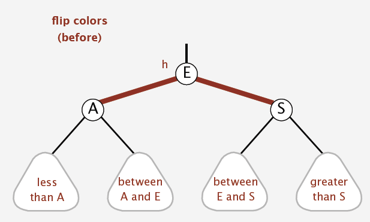
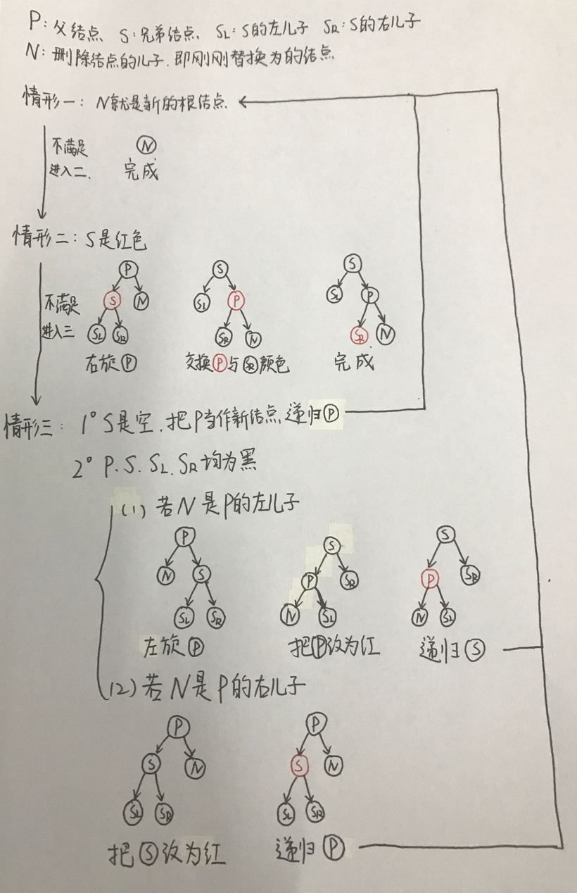

Unique Studio Lab 第一期任务，在完成之后整理一下经验。【有图！后面插入删除有我画的详细的图解！】

## 从二叉搜索树，AVL树谈起

### 二叉搜索树

二叉查找树(Binary Search Tree)，是指一棵空树或者具有下列性质的二叉树：

1. 若任意节点的左子树不空，则左子树上所有结点的值均小于它的根结点的值；
2. 若任意节点的右子树不空，则右子树上所有结点的值均大于它的根结点的值；
3. 任意节点的左、右子树也分别为二叉查找树；
4. 没有键值相等的节点。

二叉查找树相比于其他数据结构的优势在于查找、插入的时间复杂度较低，为O(log n)。但是，尽管期望是O(log n)，仍然有最坏的O(n)会出现【即：树非常高，结构退化为线性表】，为了解决这个问题，于是有了平衡树的出现。

二叉搜索树的算法比较简单，也不是重点，这里我就不再赘述。

### AVL树

平衡树这里就举一个经典的例子来说明，即AVL树(得名于它的发明者G.M. Adelson-Velsky和E.M. Landis)，它在二叉搜索树的基础上增加了以下要求：

* 任意一个结点的左右子树高度差为0或者1.

***这里的高度定义为树从底层至上的层数***

AVL树的基本算法完全继承二叉搜索树，需要新增的是为了使树变得平衡的操作，分析发现，假设结点A发生了失衡，则有以下四种情况：

1. 在A的左儿子的左子树上进行了一次插入
2. 在A的右儿子的右子树上进行了一次插入
3. 在A的左儿子的右子树上进行了一次插入
4. 在A的右儿子的左子树上进行了一次插入

显然1和2是对称的，3和4是对称的，我们称1和2的情形为单旋转，3和4的情形为双旋转。

两种单旋转如下图：


两种双旋转如下图：


可以看出实际上双旋转就是两个单旋转的结合而已。

事实上，这几种旋转的实现也是简单的，这里不多讲，我们的重点在后面。以上两种数据结构实现的C++代码可以在https://github.com/zxc479773533/uniquelab-2017-summer-assignment-1里面查看。

## 红黑树，左倾红黑树

红黑树(Red–black tree)，是每个节点都带有颜色属性的二叉查找树，颜色为红色或黑色。在二叉查找树强制一般要求以外，对于任何有效的红黑树我们增加了如下的额外要求：

1. 节点是红色或黑色。
2. 根是黑色。
3. 所有叶子都是黑色（把最后的NULL指针当做叶子）。
4. 每个红色节点必须有两个黑色的子节点。（从每个叶子到根的所有路径上不能有两个连续的红色节点。）
5. 从任一节点到其每个叶子的所有简单路径都包含相同数目的黑色节点。

这些条件就保证了：从根到叶子的最长的可能路径不多于最短的可能路径的两倍长。结果是这个树大致上是平衡的。红黑树和AVL树一样都对插入时间、删除时间和查找时间提供了最好可能的最坏情况担保。相对于AVL树来说，红黑树牺牲了部分平衡性以换取插入/删除操作时少量的旋转操作，整体来说性能要优于AVL树。

接下来我们讨论的是左倾红黑树(Left-leaning Red–Black Tree)，即增加了一条限制：所有的红色结点都位于其父结点的左儿子位置上。相对于红黑树来说，左倾红黑树的插入操作要讨论的多一些，删除操作则要方便一些。

>关于LLRBTree，我相信这篇论文是极好的 http://www.cs.princeton.edu/~rs/talks/LLRB/RedBlack.pdf，想要深刻，完全的学习LLRBTree可以阅读这篇论文。

## 左倾红黑树的基本操作和类实现

首先，树的结点类如下：

```c++
enum RBTColor {RED, BLACK};

class RBTNode {
    public:
        RBTColor color; //存储颜色
        T key; //存储数据
        RBTNode *left; //左子结点
        RBTNode *right; //右子结点
        RBTNode *parent; //父结点
    //构造函数
        RBTNode(RBTColor c, T value, RBTNode *l, RBTNode *r, RBTNode *p) :
        color(c), key(value), left(l), right(r), parent(p) {};
};
```

大概就是比二叉搜索树多了个存储颜色的单元。

基本操作有：

* insert(const T&)：插入指定的元素结点
* erase(count T&)：删除指定的元素结点
* clear()：清空该树
* count(const T&)：判断该数据是否存在
* empty()：判断该树是否为空
* size()：返回树中结点的个数

该类实现的代码如下：

```c++
class Set {
    public:
        void insert(const T& element); //插入指定的结点
        void erase(const T& element); //删除指定的结点
        void clear(); //清空树
        int count(const T& element) const; //返回该数据是否存在
        bool empty(); //返回该树是否为空
        size_t size(); //返回树中结点的个数
    private:
        RBTNode *root = NULL;
        /* 接口 */
        void ins(RBTNode* tree, RBTNode* node); //插入
        void del(RBTNode* node); //删除
        void _clear(RBTNode* tree); //删除
        int _count(const T&) const; //判断数据是否存在
        size_t _size(RBTNode*  tree); //计数
        /* 内部操作函数 */
        RBTNode* find(RBTNode* tree, const T&) const; //查找
        RBTNode* find_min(RBTNode* tree); //查找最小值
        RBTNode* find_max(RBTNode* tree); //查找最大值
        /* 结点相关操作 */
        RBTNode* son(RBTNode* tree); //返回单儿子时的儿子结点
        RBTNode* sibling(RBTNode* tree); //返回兄弟结点
        RBTNode* grandparent(RBTNode* tree); //返回祖父结点
        RBTNode* uncle(RBTNode* tree); //返回叔父结点
        /* 红黑树特有部分函数 */
        void leftrotation(RBTNode* tree); //执行左旋
        void rightrotation(RBTNode* tree); //执行右旋
        void changecolor(RBTNode* tree); //执行改色
        /* 插入删除的辅助函数 */
        void insadjust(RBTNode* node); //插入调整
        void replace(RBTNode* P, RBTNode* N); //结点替换
        void del_adjust1(RBTNode* node); //删除调整一
        void del_adjust2(RBTNode* node); //删除调整二
        void del_adjust3(RBTNode* node); //删除调整三
        void del_adjust4(RBTNode* node); //删除调整四
        void del_adjust5(RBTNode* node); //删除调整五
};
```
## 辅助操作函数

**find**

就是二叉搜索树的查找操作，一个深搜就好。

```c++
/* 查找 */
RBTNode* Set::find(RBTNode* tree, const T& key) const{
    if (tree == NULL)
        return NULL;
    else {
        if (tree->key == key)
            return tree;
        else if (tree->key > key)
            return find(tree->left, key);
        else
            return find(tree->right, key);
    }
}
```

**find_min 和 find_max**

结合二叉搜索树数据的特性，我们只需要一直向左搜或者向右搜即可。实现的代码如下：

```c++
/* 查找最小数 */
RBTNode* Set::find_min(RBTNode* tree) {
    if (tree->left == NULL)
        return tree;
    else
        return find_min(tree->left);
}

/* 查找最大数 */
RBTNode* Set::find_max(RBTNode* tree) {
    if (tree->right == NULL)
        return tree;
    else
        return find_max(tree->right);
}
```

此外，我们还需要一些快速返回附近结点的方法，从而使得我们在插入和删除的操作中可以少写一下代码。

四种返回附近结点的函数如下：

```c++
/* 返回单儿子时的儿子结点 */
RBTNode* Set::son(RBTNode* tree) {
    if (tree->left != NULL)
        return tree->left;
    else
        return tree->right;
}

/* 返回兄弟结点 */
RBTNode* Set::sibling(RBTNode* tree) {
    if (tree == tree->parent->left)
        return tree->parent->right;
    else
        return tree->parent->left;
}

/* 返回祖父结点 */
RBTNode* Set::grandparent(RBTNode* tree) {
    return tree->parent->parent;
}

/* 返回叔父结点 */
RBTNode* Set::uncle(RBTNode* tree) {
    RBTNode* g = grandparent(tree);
    if (tree->parent == g->left)
        return g->right;
    else
        return g->left;
}
```

## 一些基本操作的实现

借助辅助函数，可以轻松的实现几个简单的基本操作。

不多说了，直接放代码。

```c++
/* 清空树接口 */
void Set::clear() {
    _clear(root);
    root = NULL;
}

/* 清空树实现 */
void Set::_clear(RBTNode* tree) {
    if (tree->left != NULL)
        _clear(tree->left);
    else if (tree->right != NULL)
        _clear(tree->right);
    delete(tree);
    tree = NULL;
}

/* 判断数据是否存在接口 */
int Set::count(const T& key) const {
    return _count(key);
}

/* 判断数据是否存在实现 */
int Set::_count(const T& key) const{
    if (find(root, key) != NULL)
        return 1;
    else
        return 0;
}       

/* 返回该树是否为空 */
bool Set::empty() {
    if (root == NULL)
        return true;
    else
        return false;
}

/* 返回树中结点的个数 */
size_t Set::size() {
    return _size(root);
}

/* 计数 */
size_t Set::_size(RBTNode*  tree) {
    if (tree == NULL)
        return 0;
    else
        return 1 + _size(tree->left) + _size(tree->right);
}
```

## 调整树结构的操作

我们的重点，也是红黑树实现的难点在于插入和删除操作。在此之前，我们先解决几个调整树的基本操作。


### 左旋

类似于AVL树，左旋和右旋操作目的是平衡树的高度，以满足红黑树的 “所有路径上黑色结点的数目相同” 的条件。

红黑树左旋的基本操作和AVL树一样，唯一不同的是要交换k1和k2结点的颜色，左旋演示的动画效果如下：


实现的代码如下：

```c++
/* 执行左旋 */
void Set::leftrotation(RBTNode* k1) {
    RBTNode *k2 = k1->right;
    RBTNode *p = k1->parent;
    RBTColor t = k1->color;
    k1->right = k2->left;
    if (k2->left != NULL)
        k2->left->parent = k1;
    k2->left = k1;
    k1->parent = k2;
    if (p != NULL && p->left == k1)
        p->left = k2;
    else if (p != NULL && p->right == k1)
        p->right = k2;
    k2->parent = p;
    k1->color = k2->color;
    k2->color = t;
    if (k1 == root)
        root = k2;
}
```

### 右旋

类似于左旋的算法，我们可以轻易写出右旋的算法，右旋演示的动画效果如下：


实现的代码如下：

```c++
/* 执行右旋 */
void Set::rightrotation(RBTNode* k1) {
    RBTNode *k2 = k1->left;
    RBTNode *p = k1->parent;
    RBTColor t = k1->color;
    k1->left = k2->right;
    if (k2->right != NULL)
        k2->right->parent = k1;
    k2->right = k1;
    k1->parent = k2;
    if (p != NULL && p->left == k1)
        p->left = k2;
    else if (p != NULL && p->right == k1)
        p->right = k2;
    k2->parent = p;
    k1->color = k2->color;
    k2->color = t;
    if (k1 == root)
        root = k2;
}
```

在写左旋和右旋的时候，要注意以下几点：

* 由于我们把NULL指针当做黑色的叶子结点，因此必须讨论k2的儿子是否存在的问题。
* 更改父结点的时候，要讨论父结点不存在的情况，这个时候就不用管父结点的儿子指针。
* 旋转的时候如果动了根结点，要重新指定根结点的值。

### 改色

改色的操作在红黑树中并不存在，是左倾红黑树的一个操作，目的是为了消除红色结点在右侧的情况，改色的过程如下图：



如果一个黑色结点X的两个儿子都是红色，那么把这两个儿子改为黑色，把X改为红色。该过程实现的代码如下：

```c++
/* 执行改色 */
void Set::changecolor(RBTNode* tree) {
    if (tree != root) {
        if (tree->color == BLACK && tree->left->color == RED && tree->right->color == RED) {
            tree->left->color = tree->right->color = BLACK;
            tree->color = RED;
        }
    }
    else
        tree->left->color = tree->right->color = BLACK;
}
```

要注意，如果该结点就是根结点，就不必再把该结点改为红色，因为所有的路径都是要经过它的。

## 插入和删除

插入和删除是红黑树里的重头戏，也是最为麻烦的部分。

***PS：我感觉左倾红黑树和原版红黑树相比，这两种操作各自有各自的需要多讨论的地方，并非左倾红黑树一定简单些***

### 插入操作insert

分析一下插入需要做什么，在我们执行一次普通的二叉搜索树的插入操作后，是否就完成了呢？

并不，因为新插入的结点如果是黑色，那么一定打破了 “从根结点到任意叶子结点的路径上黑色结点的个数相等” 这条规则，所以我们总是插入红色的结点，如果我们插入在黑色结点的左儿子位置，那么很幸运，我们的操作完成了。如果不是这种情况呢？那么我们就需要调整了，于是我们用一个insadjust()函数来进行对树的调整，以使得它重新满足红黑树的平衡性质。

这个整体流程的代码如下：

```c++
/* 插入指定的结点接口 */
void Set::insert(const T& key) {
    RBTNode* new_node = new RBTNode(RED, key, NULL, NULL, NULL);
    if (root == NULL)
        root = new_node;
    else
        ins(root, new_node);
    insadjust(new_node);
}
```

二叉搜索树插入的代码如下，并不需要多说：

```c++
/* 插入指定的结点实现 */
void Set::ins(RBTNode* tree, RBTNode* node) {
    RBTNode *p = tree, *pre = NULL;
    while (p != NULL) {
        if (p->key == node->key)
            break;
        else if (p->key > node->key) {
            pre = p;
            p = p->left;
        }
        else if (p->key < node->key) {
            pre = p;
            p = p->right;
        }
        if (p == NULL) {
            if (pre->key > node->key)
                pre->left = node;
            else
                pre->right = node;
            node->parent = pre;
            delete(p);
        }
    }
}
```

好了，接下来我们来看插入一个新的红色结点之后之后的调整。

首先，要记得讨论根结点插入的情形，直接给黑色。

***在接下来的讨论中，N表示新插入的结点，P表示父结点，G表示祖父结点，U表示叔父结点***

接着开始讨论父结点的颜色，：

&emsp;&emsp;一，如果P是黑色，那么有两种情况：

&emsp;&emsp;&emsp;&emsp;1.若是以左儿子插入，则调整完成，没有破坏任何性质

&emsp;&emsp;&emsp;&emsp;2.若是以右儿子插入，则红色结点出现在了右侧，违反左倾红黑树的要求，此时对P执行一次左旋即可。

&emsp;&emsp;二，如果P是红色，那么P一定也存在父结点，我们称之为祖父结点，此时也有两种情况：

&emsp;&emsp;&emsp;&emsp;1.若是以左儿子插入，则首先对G执行一次右旋，平衡黑色结点个数。接下来对P执行一次改色，以消除右侧的红色。此时该结构的“根结点”P是红色，我们可以把P当做新插入的结点进行递归操作。

&emsp;&emsp;&emsp;&emsp;2.若是以右儿子插入，则首先对P进行一直左旋，接下来的结构便和第一种情形一致了。

文字可能不方便理解，我把整个步骤画了个图：


该调整实现的代码如下：

```c++
/* 插入调整 */
void Set::insadjust(RBTNode* node) {
    if (node->parent == NULL) //若是根结点
        node->color = BLACK;
    else {
        if (node->parent->color == BLACK) { //若父结点为黑
            if(node == node->parent->right) {
                if (sibling(node) == NULL || sibling(node)->color == BLACK)
                    leftrotation(node->parent);
                else {
                    changecolor(node->parent);
                    insadjust(node->parent);
                }
            }
        }
        else { //若父结点为红
            if (node == node->parent->left) { //若以左儿子插入
                rightrotation(grandparent(node));
                changecolor(node->parent);
                insadjust(node->parent); //把node->parent视为刚插入的结点递归
            }
            else { //若以右儿子插入
                leftrotation(node->parent);
                rightrotation(node->parent);
                changecolor(node);
                insadjust(node); //把node视为刚插入的结点递归            
            }
        }
    }
}
```

### 删除操作erase

相比插入操作，删除操作就要复杂了很多。首先，类似于二叉搜索树的删除，我们也要分这三种情况：

* 如果要删的结点有两个子结点，那么我们可以复制左子树中大的元素的值到该结点，然后删除那个最小元，就变成了删只有一个儿子的结点的操作。
* 如果要删的结点是叶子结点，那么我们把该结点的一个NULL指针当做它的儿子，也变成了删只有一个儿子的结点的操作。
* 如果要删的结点只有一个儿子，接下来还要分三种情况：

&emsp;&emsp;&emsp;&emsp;1. 如果要删除的是红色结点，那么我们用它的儿子替换它就好。

&emsp;&emsp;&emsp;&emsp;2. 如果要删除的结点是黑色，并且它的儿子是红色，那么我们直接把它的儿子变成红色，然后替换它即可。

&emsp;&emsp;&emsp;&emsp;3.唯一复杂的是要删除的结点和它的儿子均为黑色的时候，我们也先用它的儿子进行一次替换，然后开始调整。

删除的具体体现就在于替换上，在写替换函数的时候，记得把要删的结点释放了。

上述过程具体实现的代码如下：

```c++
/* 删除指定的结点接口 */
void Set::erase(const T& key) {
    RBTNode *node = find(root, key);
    if (node != NULL)
        del(node);
}

/* 结点替换 */
void Set::replace(RBTNode* node, RBTNode* N) {
    RBTNode *P = node->parent; //父结点    
    if (P == NULL) { //若要被换掉的是根结点
        if (N != NULL)
            N->parent = NULL;
        root = N;
    }
    else {
        if (P->left == node)
            P->left = N;
        else
            P->right = N;
    }
}

/* 删除指定的结点实现 */
void Set::del(RBTNode* node) {
    if (node->left != NULL && node->left != NULL) { //若要删除的结点有两个子结点
        RBTNode *max = find_max(node->left);
        node->key = max->key;
        del(max);
    }
    else { //其他情况，若是叶子把一个NULL当做儿子
        RBTNode *P = node->parent; //父结点
        RBTNode *N = son(node); //儿子结点
        RBTColor N_color = (N != NULL)? N->color : BLACK; //儿子结点颜色，空结点当做黑色
        if (node->color == RED) { //若要删除的结点为红
            replace(node, N); //用N替换该结点
            if (N != NULL)
                N->parent = P;
            delete(node);
        }
        else if (node->color == BLACK && N_color == RED) { //若要删除的结点为黑，其儿子为红
            N->color = BLACK; //将其变成黑
            replace(node, N); //用N替换该结点
            N->parent = P; //此时N一定非空
            delete(node);
        }
        else { //若该结点和N均为黑色(N可能为NULL)
            replace(node, N); //用N替换该结点            
            if (N != NULL) {
                N->parent = P;
                del_adjust1(N); //进入情形一
            }
            delete(node);
        }
    }
}
```

接下来要做的是调整操作，我们分五步来执行调整。

```c++
/* 删除调整一 */
void Set::del_adjust1(RBTNode* N) {
    if (N != root) //若N不是根节点，进入情形二
        del_adjust2(N);
}
```

